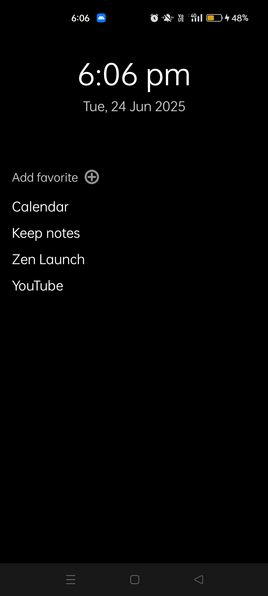
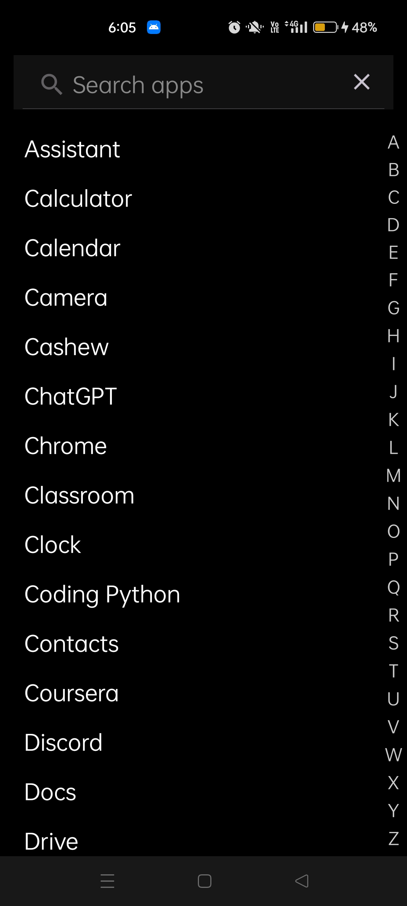
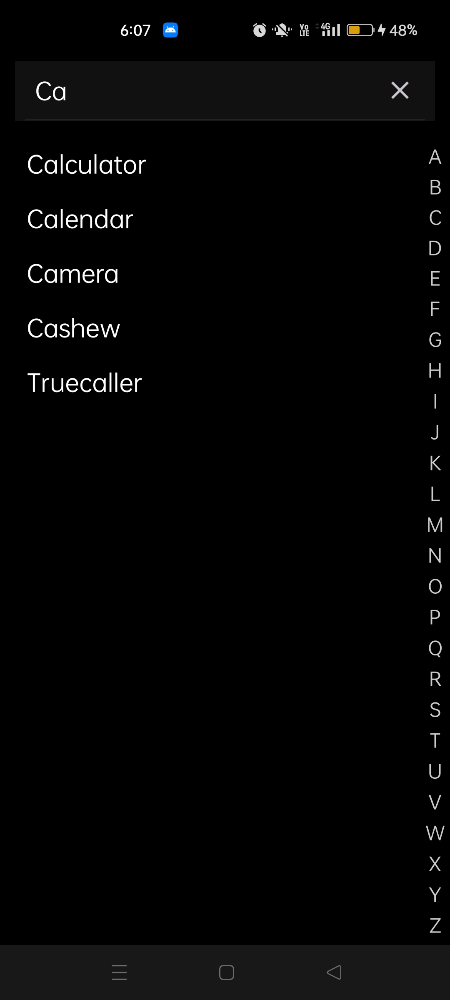

#  ZenLaunch
**Distraction-free, minimalist Android launcher** for clarity, flow, and focus.

  

##  Philosophy behind Zen Launch
> Cut everything down to the essential.

##  Features

- Minimalist home screen (date, time, favorite apps only)  
- Fast app search  
- Dark mode  
- Swipe down for notifications  
- Alphabetically sorted app list  

---

## Preview

  
  
  

## LICENSE
[**MIT**](./LICENSE)

## Star Histrory

